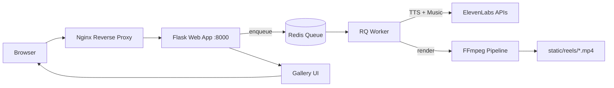
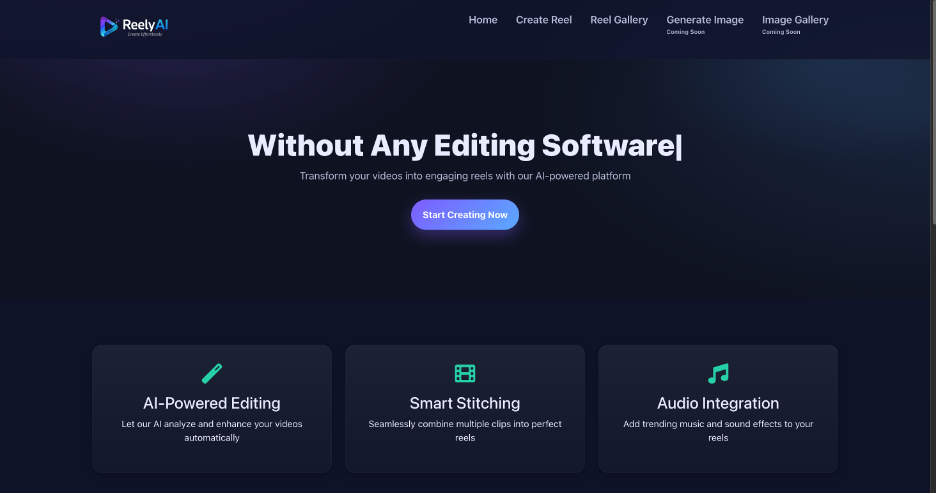
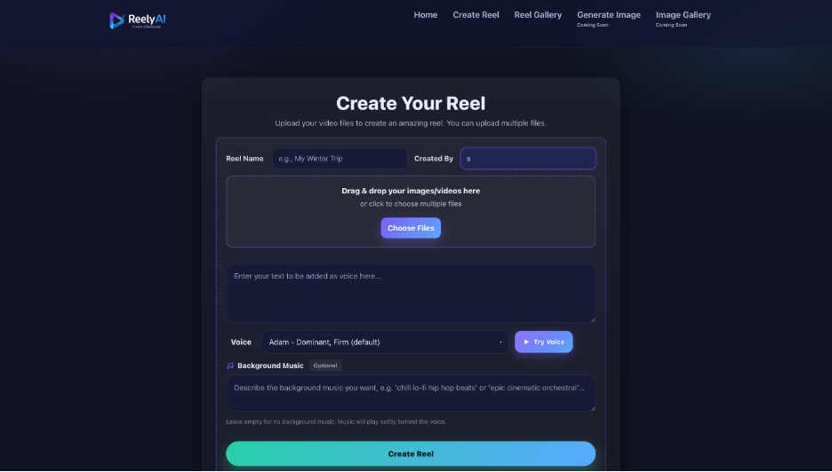
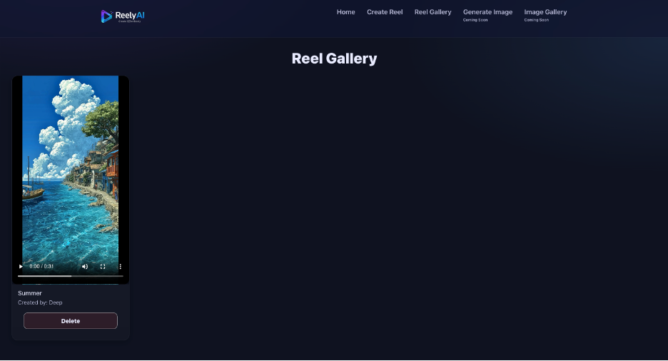
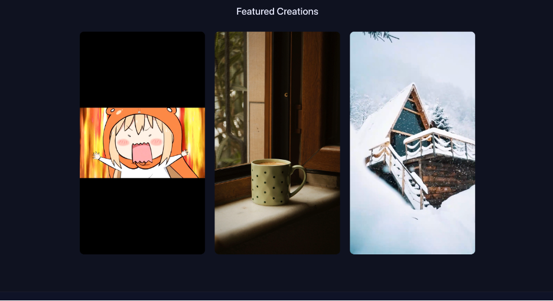

# ReelyAI : http://reelyai.duckdns.org/

# 🎬 ReelyAI - AI-Powered Reel Generator (TTS + AI Music + FFmpeg)  
**ReelyAI** is a production-style, **async reel rendering pipeline** that turns **images, GIFs, and videos** into a **1080x1920 vertical short** with **AI voiceover (ElevenLabs TTS)** and optional **AI-generated background music**, mixed and exported as a share-ready MP4.

🌐 Live: http://reelyai.duckdns.org/

> Not “just upload and merge.”  
> This is **job-queue rendering**, **media normalization**, **timeline alignment**, and **audio mixing** - the boring stuff that makes a reel look *clean*.

---

## ✅ What this project delivers

### 1) ⚡ Creator Workflow (Web UI)
- Drag & drop uploads (images, GIFs, videos)
- Reorder media before render
- Voice selection + live narration preview
- Gallery to view and manage generated reels

### 2) 🧠 AI Audio Layer (ElevenLabs)
- **Text-to-Speech** narration (voice options)
- Optional **AI background music** generated from a vibe prompt
- Mixed under narration for “final reel” audio

### 3) 🎞️ Rendering Pipeline (FFmpeg)
- Normalizes all media into **1080x1920 portrait**
- Smart timeline:
  - Images stretch to match voice duration
  - GIFs/videos preserve natural timing
- Concatenates clips + mixes audio
- Outputs to `static/reels/*.mp4`

### 4) 🧵 Background Processing (Redis + RQ)
- Render jobs run asynchronously via **Redis queue**
- Worker processes heavy lifting (TTS/music/FFmpeg)
- UI polls status → user gets realtime progress updates

---

## 🧱 Tech Stack (Production keywords)
- **Backend:** Flask + Gunicorn  
- **Queue:** Redis + RQ (background jobs / async processing)  
- **AI:** ElevenLabs (TTS + Music generation)  
- **Video:** FFmpeg (scale/pad, concat, audio mix, MP4 export)  
- **Infra:** Docker Compose (multi-service), Nginx reverse proxy (deployment)  
- **CI/CD:** GitHub Actions → auto-deploy to AWS EC2 on push to `main`

---

## Architecture



------------------------------------------------------------------------

## 🧠 How it works (end-to-end)

1.  User uploads media + voiceover text (+ optional music prompt)
2.  Flask stores files/metadata and enqueues a job in Redis
3.  Worker executes:
    -   Generate narration audio via ElevenLabs TTS
    -   Generate background music (optional)
    -   Build a timeline that matches narration duration
    -   FFmpeg pipeline:
        -   scale/pad to 1080x1920 portrait
        -   concat clips
        -   mix narration + music
4.  Final MP4 saved to `static/reels/`
5.  Reel appears in the Gallery for playback/download

------------------------------------------------------------------------

## 📦 Project Structure

``` text
ReelyAI/
├── main.py                 # Flask routes (upload, gallery, API)
├── tasks.py                # RQ job definitions
├── generate_process.py     # FFmpeg pipeline (clips, concat, audio mix)
├── text_to_audio.py        # ElevenLabs TTS + music generation
├── worker.py               # RQ worker process
├── config.py               # Environment config
├── queue_config.py         # Redis/RQ setup
├── Dockerfile
├── docker-compose.yml
├── templates/              # Jinja2 HTML templates
│   ├── base.html
│   ├── index.html
│   ├── create.html
│   ├── processing.html
│   └── gallery.html
├── static/
│   ├── css/
│   ├── img/
│   └── reels/              # Generated output videos
└── .github/workflows/
    └── deploy.yml          # Auto-deploy to EC2
```

------------------------------------------------------------------------

## ✅ Prerequisites

-   Docker + Docker Compose
-   ElevenLabs API Key (voice access may require a paid plan depending on usage)

------------------------------------------------------------------------

## 🚀 Quickstart (Docker Compose)

### 1) Clone

``` bash
git clone https://github.com/sanket3122/ReelyAI-main.git
cd ReelyAI-main
```

### 2) Create a `.env` file

``` bash
ELEVENLABS_API_KEY=your_api_key_here
```

### 3) Build + run

``` bash
docker compose build
docker compose up -d
```

### 4) Open the app

``` text
http://localhost:8000
```

------------------------------------------------------------------------

## 🧪 Local Development (without Docker)

> You’ll need Redis installed locally.

``` bash
pip install -r requirements.txt

export ELEVENLABS_API_KEY="your_api_key_here"
export REDIS_URL="redis://localhost:6379/0"
export FLASK_ENV="development"

# Terminal 1
redis-server

# Terminal 2 (RQ worker)
python worker.py

# Terminal 3 (Flask app)
python main.py
```

------------------------------------------------------------------------

## 🔐 Environment Variables

| Variable | Required | Description |
|--------------------|-----------------------|-----------------------------|
| `ELEVENLABS_API_KEY` | ✅ | ElevenLabs API key for narration + music |
| `REDIS_URL` | ⚠️ (local dev) | Redis connection string (Docker sets this for you) |

------------------------------------------------------------------------

## ☁️ Deployment (AWS EC2 + GitHub Actions)

The repo includes a GitHub Actions workflow that auto-deploys to EC2 on every push to `main`.

Add these GitHub Secrets:

| Secret               | Description                               |
|----------------------|-------------------------------------------|
| `EC2_HOST`           | EC2 public IP / hostname                  |
| `EC2_SSH_KEY`        | EC2 private key (paste full PEM contents) |
| `ELEVENLABS_API_KEY` | ElevenLabs API key used at runtime        |

------------------------------------------------------------------------

## 🛠️ Operational Notes (real-world stuff)

-   FFmpeg rendering is CPU-heavy. If your instance is tiny, it will suffer.
-   If you want durability across deployments, persist volumes for:
    -   uploads
    -   rendered `static/reels/`
-   Add a cleanup job (cron/worker) if you expect lots of reels (storage grows fast).

------------------------------------------------------------------------

## 📸 Screenshots

<p align="center">
  
  <br/>
  <sub><b>Home:</b> Landing page with quick access to Create Reel and Gallery.</sub>
</p>

<p align="center">
  
  <br/>
  <sub><b>Create Reel:</b> Upload media, add narration text, pick a voice, and optionally generate background music.</sub>
</p>

<p align="center">
  
  <br/>
  <sub><b>Reel Gallery:</b> Browse generated reels, preview playback, and manage outputs.</sub>
</p>

<p align="center">
  
  <br/>
  <sub><b>Featured Creations:</b> Sample reels showing the final vertical format output.</sub>
</p>


### Happy learning!